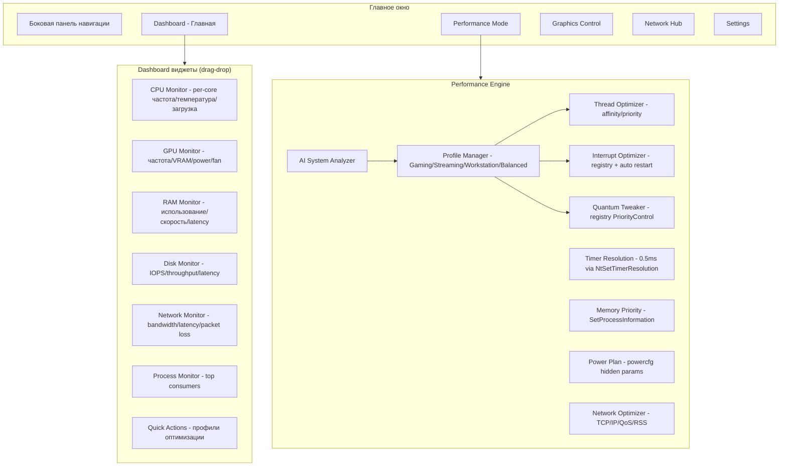

# PC Optimizer Premium - Финальный план с современным UI и полным User-mode

## Обзор

**Премиум-продукт** с полностью кастомным ImGui интерфейсом и **функционально полным User-mode** (kernel driver опционален только для маргинальных случаев).

### Ключевые принципы
- ✅ **Dashboard-стиль** — главная страница с живыми виджетами, drag-drop, графиками реального времени
- ✅ **Полностью кастомный ImGui** — нет стандартных элементов, уникальный дизайн
- ✅ **User-mode = полноценная замена kernel** через documented/undocumented NT API
- ✅ **Всё рабочее, без заглушек** — каждая функция реально работает
- ✅ **Автоматизация** — AI предлагает профили, пользователь утверждает
- ✅ **Сценарии использования** — Gaming (input lag), Streaming (балансировка), Workstation (I/O), Enthusiast (тонкий контроль), Casual (one-click)

---

## Архитектура UI/UX

---

## Задачи реализации

### 1. Кастомный ImGui UI Framework

#### 1.1 Custom Widget System
- Создать `src/ui/widgets/base_widget.h/cpp` — базовый класс для всех виджетов
  - Интерфейс: `Render()`, `Update()`, `GetSize()`, `SetPosition()`
  - Drag-drop поддержка через ImGui::SetDragDropPayload
  - Resize handles (углы виджета)
  - Сохранение/загрузка layout в JSON
- Создать `src/ui/widgets/widget_manager.h/cpp` — менеджер виджетов
  - Grid layout система
  - Snap-to-grid при перемещении
  - Auto-layout presets (1x1, 2x2, 3x2, custom)
  - Save/Load layout через ImGui .ini альтернативу

#### 1.2 Custom UI Components (100% кастом, 0% стандартных элементов)
- **Button:** `src/ui/components/custom_button.h/cpp`
  - Градиентный фон (accent color → darker shade)
  - Анимация hover (glow эффект)
  - Ripple эффект при клике
  - Icon + Text поддержка
- **Slider:** `src/ui/components/custom_slider.h/cpp`
  - Современный track с градиентом
  - Анимированный thumb (scale на hover)
  - Tooltips с текущим значением
  - Snap to step опция
- **Toggle Switch:** `src/ui/components/custom_toggle.h/cpp`
  - Animated переключение (smooth transition)
  - Glow эффект в ON состоянии
  - Icon внутри switch (опционально)
- **Graph:** `src/ui/components/custom_graph.h/cpp`
  - Real-time line graph (scrolling buffer)
  - Multi-series support (CPU cores, GPU metrics)
  - Gradient fill под линией
  - Hover tooltips с точными значениями
  - Zoom/Pan support
- **Card:** `src/ui/components/custom_card.h/cpp`
  - Rounded corners + shadow
  - Gradient border (accent color)
  - Hover animation (slight elevation)
  - Icon + Title + Content layout
- **Progress Bar:** `src/ui/components/custom_progress.h/cpp`
  - Circular progress (для CPU/GPU usage)
  - Linear progress с gradient fill
  - Animated percentage text
- **Dropdown:** `src/ui/components/custom_dropdown.h/cpp`
  - Custom popup с анимацией (fade in/scale)
  - Search field для длинных списков
  - Icon + Text entries
- **Modal:** `src/ui/components/custom_modal.h/cpp`
  - Backdrop blur эффект
  - Fade in/out animation
  - Drag to close gesture (опционально)

#### 1.3 Navigation System
- **Sidebar:** `src/ui/navigation/sidebar.h/cpp`
  - Vertical navigation bar (слева)
  - Категории с inline раскрытием подкатегорий
  - Иконки + текст (collapse опция — только иконки)
  - Hover effects + selection indicator (gradient bar)
  - Структура:
    - 🏠 **HOME** (Dashboard)
    - ⚡ **PERFORMANCE** → Gaming Mode, Streaming Mode, Workstation
    - 🎮 **GRAPHICS CONTROL** → GPU Settings, Display Settings
    - 🌐 **NETWORK** → Connection Hub, Latency Optimizer
    - ⚙️ **SETTINGS** → Preferences, About
- **Top Bar:** `src/ui/navigation/topbar.h/cpp`
  - Window controls (minimize, maximize, close) — кастомные
  - App logo + title
  - System tray indicator (current mode + performance)
  - Notification center icon

---

### 2. Dashboard — Главная страница

#### 2.1 Widget Layout Manager
- Создать `src/ui/pages/dashboard.h/cpp`
- Default layout (2x3 grid):
  - Row 1: CPU Widget (large) | GPU Widget (large)
  - Row 2: RAM Widget (medium) | Disk Widget (medium) | Network Widget (medium)
  - Row 3: Quick Actions (full width) | Process Monitor (full width)
- Drag-drop перестановка виджетов
- Context menu: Hide/Show widget, Reset layout
- Save layout в `%AppData%/PCOptimizer/dashboard_layout.json`

#### 2.2 CPU Monitor Widget
- Создать `src/ui/widgets/cpu_widget.h/cpp`
- **Данные** (через LibreHardwareMonitor):
  - Per-core частота (real-time graph, линия на каждое ядро)
  - Per-core температура (color-coded: <60°C green, 60-80 yellow, >80 red)
  - Per-core загрузка (bar chart)
  - C-states time (pie chart — C0/C1/C2/C3)
  - DPC latency (отдельный mini-graph внизу виджета)
- **UI:**
  - Header: "CPU" + model name + текущая avg частота
  - Main area: Multi-line graph (частота/температура/загрузка — toggle между режимами)
  - Footer: C-states pie + DPC latency graph

#### 2.3 GPU Monitor Widget
- Создать `src/ui/widgets/gpu_widget.h/cpp`
- **Данные** (через LibreHardwareMonitor или NVML/ADL):
  - GPU core clock (graph)
  - GPU memory clock (graph)
  - Температура (circular progress indicator)
  - VRAM usage (bar + percentage)
  - Power limit (bar + watts)
  - Fan speed (RPM + percentage)
- **UI:**
  - Header: "GPU" + model name
  - Main: Dual graph (core clock + memory clock)
  - Side: Circular temp indicator + VRAM bar + Power bar + Fan indicator

#### 2.4 RAM Monitor Widget
- Создать `src/ui/widgets/ram_widget.h/cpp`
- **Данные:**
  - Total usage (bar + GB/total GB)
  - Speed (MT/s) — static
  - Latency (ns) — через AIDA64 DLL или manual calculation
  - Bandwidth (GB/s) — graph при активном использовании
- **UI:**
  - Header: "RAM" + total capacity
  - Main: Linear progress bar (usage)
  - Stats: Speed | Latency | Bandwidth (text + small sparkline)

#### 2.5 Disk Monitor Widget
- Создать `src/ui/widgets/disk_widget.h/cpp`
- **Данные** (для всех дисков, dropdown selector):
  - IOPS (read/write, dual bar chart)
  - Throughput (MB/s, graph)
  - Queue depth (number)
  - Latency (ms, graph)
  - Temperature (только NVMe, text + color indicator)
- **UI:**
  - Header: "Disks" + dropdown (C:, D:, etc.)
  - Main: Dual graph (throughput R/W)
  - Footer: IOPS bars + latency mini-graph

#### 2.6 Network Monitor Widget
- Создать `src/ui/widgets/network_widget.h/cpp`
- **Данные:**
  - Bandwidth up/down (graph, Mbps или Gbps)
  - Latency (ping to 8.8.8.8 или custom, graph)
  - Packet loss (percentage)
  - DPC time для NIC (через xperf или manual)
- **UI:**
  - Header: "Network" + adapter name
  - Main: Dual graph (upload/download bandwidth)
  - Footer: Latency graph + packet loss % + DPC time

#### 2.7 Process Monitor Widget
- Создать `src/ui/widgets/process_widget.h/cpp`
- **Данные:**
  - Top 10 CPU consumers (process name, CPU %, threads, handles)
  - Top 10 GPU consumers (process name, GPU %, VRAM)
  - Top 10 RAM consumers (process name, RAM MB, commits)
- **UI:**
  - Header: "Processes" + tabs (CPU / GPU / RAM)
  - Main: Table с колонками (Name, Usage, Threads, Handles)
  - Footer: Quick action — "Optimize selected process" (open advanced dialog)

#### 2.8 Quick Actions Widget
- Создать `src/ui/widgets/quick_actions.h/cpp`
- **Кнопки-профили** (большие, с иконками):
  - 🎮 **Gaming Mode** — hover показывает "Min input lag, stable 1% lows"
  - 📹 **Streaming Mode** — hover: "Balance game+OBS, encoder priority"
  - 💼 **Workstation Mode** — hover: "Rendering/compilation, disk I/O"
  - ⚖️ **Balanced Mode** — hover: "Default Windows settings"
- **AI Suggest кнопка:** "Analyze & Recommend" — открывает modal с AI рекомендациями
- **Current Mode indicator:** текст + accent color border вокруг активного режима

---

### 3. Performance Mode Page

#### 3.1 AI System Analyzer
- Создать `src/performance/ai_analyzer.h/cpp`
- **Анализ системы:**
  - Detect hardware: CPU (P-cores/E-cores count), GPU (NVIDIA/AMD), RAM (speed), Disk (NVMe/SATA)
  - Detect running processes: игры, стримминг ПО, рендереры, IDE, браузеры
  - Detect bottlenecks: CPU bound (high usage), GPU bound, RAM limited, disk I/O saturation
  - Detect anti-cheat: EasyAntiCheat, BattlEye, Vanguard (kernel-mode детекция)
- **Рекомендации:**
  - Предложить профиль (Gaming/Streaming/Workstation) на основе запущенных процессов
  - Предложить конкретные твики: "Set game to P-cores", "Route NVMe IRQ to E-core 8", etc.
  - Вывести warnings: "Anti-cheat detected, некоторые твики недоступны"
- **UI:**
  - Modal окно с результатами анализа
  - Секции: Hardware | Running Apps | Bottlenecks | Recommendations
  - Кнопки: "Apply Recommended Profile" | "Customize Manually" | "Cancel"

#### 3.2 Profile Manager
- Создать `src/performance/profile_manager.h/cpp`
- **Профили** (JSON-based, `%AppData%/PCOptimizer/profiles/`):
  - **Gaming.json:**
    - Thread affinity: game процесс → P-cores only
    - Thread priority: game → High
    - Interrupt affinity: GPU IRQ → P-core 0, NVMe → E-core 8
    - Quantum: Win32PrioritySeparation = 0x26 (short, variable)
    - Timer resolution: 0.5ms
    - Memory priority: game → High
    - Power plan: Ultimate Performance + hidden tweaks (Parked cores = 0)
    - Network: TCP Optimizer presets (gaming), disable Nagle
  - **Streaming.json:**
    - Thread affinity: game → P-cores 0-5, OBS → E-cores + P-cores 6-7
    - Thread priority: game → High, OBS encoder threads → Above Normal
    - Interrupt affinity: GPU → P-core 0, NIC → E-core 9
    - Quantum: 0x26 (balanced)
    - Network: QoS для OBS stream, RSS tuning
  - **Workstation.json:**
    - Thread affinity: spread across all cores
    - Interrupt affinity: NVMe → dedicated E-core
    - Memory priority: render/compiler → High
    - Power plan: balanced (allow turbo, но не aggressive)
    - Disk: Disable write cache flushing (только для SSD with capacitor)
  - **Balanced.json:**
    - Default Windows settings (undo all tweaks)
- **Функции:**
  - `LoadProfile(name)` — применить профиль
  - `SaveProfile(name, settings)` — сохранить кастомный профиль
  - `ExportProfile(path)` — экспорт для sharing
  - `ImportProfile(path)` — импорт community профилей

#### 3.3 Thread Optimizer (User-mode только)
- Создать `src/performance/thread_optimizer.h/cpp`
- **Методы:**
  - `SetThreadAffinity(PID, TID, mask)` — через `SetThreadAffinityMask` (user processes)
  - `SetThreadPriority(PID, TID, priority)` — через `SetThreadPriority`
  - `DisablePriorityBoost(PID, TID)` — через `SetThreadPriorityBoost(FALSE)`
  - `FindProcessThreads(processName)` — enumerate threads через `CreateToolhelp32Snapshot`
  - `GetThreadName(TID)` — через `GetThreadDescription` (Win10 1607+)
- **Ограничения User-mode:**
  - ❌ Не работает для System (PID 4), CSRSS, Registry процессов
  - ✅ Работает для всех user-level процессов (игры, приложения)
  - **Workaround для protected:** документировать, что это kernel-only feature
- **UI (в Performance Mode):**
  - Table: Process | Thread Name | Current Affinity | Current Priority
  - Actions: Set Affinity (popup с CPU selector) | Set Priority (dropdown) | Disable Boost

#### 3.4 Interrupt Optimizer (User-mode через Registry)
- Создать `src/performance/interrupt_optimizer.h/cpp`
- **Методы:**
  - `SetDeviceIRQAffinity(deviceInstanceID, affinityMask)`:
    - Записать в `HKLM\SYSTEM\CurrentControlSet\Enum\{DeviceInstanceID}\Device Parameters\Interrupt Management\Affinity Policy`
    - `DevicePolicy = 0x04` (IrqPolicySpecifiedProcessors)
    - `AssignmentSetOverride = affinityMask` (REG_QWORD)
  - `GetDeviceIRQ(deviceInstanceID)` — получить IRQ через SetupDiGetDeviceProperty
  - `RestartDevice(deviceInstanceID)` — через SetupDiCallClassInstaller (DIF_PROPERTYCHANGE, DICS_DISABLE → DICS_ENABLE)
  - `AutoRouteInterrupts()`:
    - GPU → P-core 0
    - NVMe → E-core 8 (или последний доступный)
    - NIC → E-core 9
    - USB controllers → E-cores 10-11
    - Audio → E-core 12
- **UI:**
  - Table: Device | Current IRQ | Current Affinity | Recommended Affinity
  - Actions: Apply Recommended | Custom Affinity (CPU picker) | Restart Device
  - Warning: "Device restart required for changes to take effect"

#### 3.5 Quantum Tweaker (User-mode через Registry)
- Создать `src/performance/quantum_tweaker.h/cpp`
- **Методы:**
  - `SetQuantum(mode)`:
    - Registry: `HKLM\SYSTEM\CurrentControlSet\Control\PriorityControl\Win32PrioritySeparation`
    - Modes:
      - Gaming: `0x26` (short, variable, foreground boost)
      - Balanced: `0x02` (long, fixed, no boost)
      - Custom: user-defined bitmask
  - `GetCurrentQuantum()` — прочитать текущее значение
  - `ApplyQuantum()` — изменения применяются сразу (NtSetSystemInformation fallback если нужно)
- **UI:**
  - Presets: Gaming | Balanced | Custom
  - Custom: Sliders для Length (short/medium/long), Variability (fixed/variable), Foreground boost (0-3x)
  - Explanation tooltips: "Short quantum = better responsiveness for games"

#### 3.6 Timer Resolution Optimizer
- Создать `src/performance/timer_optimizer.h/cpp`
- **Методы:**
  - `SetTimerResolution(resolution_us)`:
    - `NtSetTimerResolution(resolution_100ns, TRUE, &actualResolution)`
    - Target: 5000 (0.5ms) для gaming, 10000 (1ms) default
  - `GetCurrentResolution()` — через `NtQueryTimerResolution`
  - `MonitorTimerUsers()` — detect какие процессы используют high-res timer (через ETW или manual)
- **UI:**
  - Slider: 0.5ms — 1ms — 2ms — 15.6ms (default)
  - Current resolution indicator
  - Warning: "Lower resolution = higher power consumption"
  - Checkbox: "Auto-enable when game detected"

#### 3.7 Memory Priority Optimizer
- Создать `src/performance/memory_optimizer.h/cpp`
- **Методы:**
  - `SetMemoryPriority(PID, priority)`:
    - `SetProcessInformation(hProcess, ProcessMemoryPriority, &priority, sizeof(priority))`
    - Priorities: MEMORY_PRIORITY_LOWEST (1) → MEMORY_PRIORITY_NORMAL (5) → MEMORY_PRIORITY_BELOW_NORMAL (4) → MEMORY_PRIORITY_MEDIUM (3) → MEMORY_PRIORITY_HIGH (2) → MEMORY_PRIORITY_VERY_HIGH (1)
  - `SetPagePriority(PID, priority)` — аналогично для page priority
  - `AutoPrioritize()` — game/render процессы → High, браузеры → Low
- **UI:**
  - Process list с Memory Priority column
  - Dropdown для установки priority
  - Auto-prioritize button

#### 3.8 Power Plan Optimizer
- Создать `src/performance/power_optimizer.h/cpp`
- **Методы (через powercfg APIs):**
  - `SetActivePlan(guid)` — switch между планами
  - `SetHiddenSetting(setting, value)`:
    - `PROCESSOR_PERF_CORE_PARKING_MIN_CORES = 100` (disable parking)
    - `PROCESSOR_FREQUENCY_LIMIT = 0` (no limit)
    - `PROCESSOR_THROTTLE_POLICY = 0` (optimal performance)
    - `PROCESSOR_IDLE_DISABLE = 1` (для экстремальных случаев)
  - `CreateCustomPlan(name, baseGuid)` — создать кастомный план
  - `ExportPlan(path)` — powercfg /export
- **UI:**
  - Dropdown: High Performance | Ultimate Performance (unhide) | Balanced | Custom
  - Advanced: Expandable секция с hidden settings (sliders/toggles)
  - Export/Import кнопки

#### 3.9 Network Optimizer
- Создать `src/performance/network_optimizer.h/cpp`
- **Методы (Registry + documented APIs):**
  - `OptimizeTCP()`:
    - Registry: `HKLM\SYSTEM\CurrentControlSet\Services\Tcpip\Parameters`
    - `TcpAckFrequency = 1` (disable delayed ACK)
    - `TCPNoDelay = 1` (disable Nagle)
    - `TcpDelAckTicks = 0`
  - `SetQoS(enabled, dscp)`:
    - Registry: enable QoS packet scheduler
    - Set DSCP для gaming traffic (через Group Policy или registry)
  - `ConfigureRSS()`:
    - Registry: `HKLM\SYSTEM\CurrentControlSet\Control\Class\{4D36E972...}\RSS`
    - `*NumRssQueues = CPU_count` (max RSS queues)
    - `*RssBaseProcNumber = E-core_start` (route RSS to E-cores)
  - `DisableOffloading()` — через `netsh interface tcp set global` (LSO, Chimney, etc.)
- **UI:**
  - Presets: Gaming (low latency) | Streaming (QoS priority) | Default
  - Advanced: Checkboxes для TCP params, RSS, offloading
  - Test latency button (ping 8.8.8.8 before/after)

---

### 4. Graphics Control Page

#### 4.1 GPU Settings Section
- Создать `src/ui/pages/graphics_control.h/cpp`
- **NVIDIA Control:**
  - Через `nvapi64.dll` (NVAPI):
    - `NvAPI_GPU_SetPowerLimit` — изменить power limit
    - `NvAPI_GPU_SetCoreClockBoost` — offset для core clock
    - `NvAPI_GPU_SetMemoryClockBoost` — offset для memory clock
    - `NvAPI_DRS_CreateProfile` — создать application profile
    - `NvAPI_DRS_SetSetting` — установить настройки (low latency mode, max frame rate, etc.)
  - UI:
    - Power Limit slider (60% - 120% TDP)
    - Core Clock Offset slider (-200 MHz → +200 MHz)
    - Memory Clock Offset slider (-1000 MHz → +1000 MHz)
    - Fan curve editor (temperature → fan speed % graph)
    - Application profiles table (exe → settings)
- **AMD Control:**
  - Через `atiadlxx.dll` (ADL):
    - `ADL2_Overdrive8_Setting_Set` — power limit, clocks
    - `ADL2_Overdrive8_FanSpeed_Set` — fan control
  - UI: аналогично NVIDIA
- **Common:**
  - Apply button (с подтверждением)
  - Reset to default button
  - Save profile (export settings to JSON)

#### 4.2 Display Settings Section
- **Методы:**
  - `SetRefreshRate(monitor, rate)` — через `ChangeDisplaySettingsEx`
  - `SetResolution(monitor, width, height)` — аналогично
  - `EnableHDR(monitor, enable)` — через DXGI или registry
  - `SetColorDepth(monitor, depth)` — 8-bit, 10-bit, etc.
- **UI:**
  - Dropdown: монитор (если несколько)
  - Resolution dropdown
  - Refresh rate dropdown (с определением max через EDID)
  - HDR toggle
  - Color depth dropdown
  - Apply button

---

### 5. Network Hub Page

#### 5.1 Connection Optimizer
- Создать `src/ui/pages/network_hub.h/cpp`
- **Real-time stats:**
  - Current bandwidth (upload/download graph)
  - Latency to custom server (ping graph)
  - Packet loss percentage
  - Jitter (latency variance)
- **Optimization actions:**
  - One-click "Optimize for Gaming" — применить TCP tweaks + QoS
  - One-click "Optimize for Streaming" — QoS для OBS, upload priority
  - Custom DNS setter (Cloudflare 1.1.1.1, Google 8.8.8.8, custom)
  - MTU optimizer (auto-detect optimal MTU через ping tests)
- **UI:**
  - Top: Real-time graphs (bandwidth, latency)
  - Middle: Optimization buttons (large cards с иконками)
  - Bottom: Advanced settings (expand/collapse)

#### 5.2 Latency Tester
- **Методы:**
  - `PingTest(host, count)` — ICMP ping через WinAPI или custom
  - `TraceRoute(host)` — hop-by-hop latency
  - `DNSLatencyTest(dnsServers)` — resolve time для популярных доменов
- **UI:**
  - Input: host (default: game servers — EU West LoL, NA CS:GO, etc.)
  - Results table: Min/Avg/Max latency, Packet loss
  - Trace route visualization (map опционально)

---

### 6. Settings Page

#### 6.1 Preferences
- Создать `src/ui/pages/settings.h/cpp`
- **Общие настройки:**
  - Theme: Dark (default) | Light | Custom (accent color picker)
  - Language: English | Русский (i18n via JSON)
  - Start with Windows: checkbox → registry `Run` key
  - Minimize to tray: checkbox
  - Show notifications: checkbox
  - Update check: Auto | Manual | Disable
- **Dashboard preferences:**
  - Default layout: dropdown (presets)
  - Widget refresh rate: 100ms | 500ms | 1000ms (performance vs responsiveness)
  - Graph history length: 60s | 300s | 600s
- **Advanced:**
  - Enable debug logging: checkbox → write logs to `%AppData%/PCOptimizer/logs/`
  - Telemetry (opt-in): checkbox для anonymous usage stats
  - Backup settings: Export button → JSON, Import button

#### 6.2 About Section
- **Info:**
  - App version + build date
  - Developer info
  - License type (if applicable)
  - Links: GitHub, Discord community, Documentation
- **Credits:**
  - Third-party libraries (ImGui, LibreHardwareMonitor, etc.)

---

### 7. User-mode Implementation — Полная замена Kernel

#### 7.1 Documented NT API Methods
- `NtSetTimerResolution` — timer resolution
- `NtSetInformationProcess` — process priority, memory priority
- `NtSetInformationThread` — thread priority, affinity (для user processes)
- `NtQuerySystemInformation` — system stats, process list
- `SetProcessInformation` — memory priority, power throttling
- `SetThreadAffinityMask` — thread affinity
- `SetThreadPriority` — thread priority

#### 7.2 Undocumented NT API Methods
- Создать `src/core/ntapi_undocumented.h/cpp`
- **RtlAdjustPrivilege + undocumented calls:**
  - `NtSetSystemInformation(SystemFileCacheInformation)` — изменить file cache size
  - `NtSetSystemInformation(SystemDpcBehaviorInformation)` — DPC timeout (если доступно)
  - Signature scanning для internal structures (осторожно, может сломаться между билдами)
- **Direct Registry Manipulation:**
  - Interrupt affinity через `HKLM\SYSTEM\...\Interrupt Management`
  - Quantum через `PriorityControl`
  - Network через `Tcpip\Parameters`
  - Power через `HKLM\SYSTEM\...\Power`

#### 7.3 Signed Vulnerable Driver (BYOVD — Bring Your Own Vulnerable Driver)
- **Только для экстремальных случаев (опционально, не по умолчанию):**
  - Использовать известные signed vulnerable драйверы (Process Hacker KPH, GDRV.sys, etc.)
  - Загружать только если пользователь явно согласен (отдельный режим "Extreme Mode")
  - Функции:
    - Чтение/запись kernel memory
    - Изменение KTHREAD/KINTERRUPT structures
    - Patch kernel variables
  - **Риски:**
    - Anti-cheat detection (ban)
    - Нестабильность системы (BSOD)
    - Этические проблемы (использование уязвимостей)
  - **Решение:** документировать как "use at your own risk", disable по умолчанию

#### 7.4 Kernel Driver (опциональный, НЕ обязательный)
- Kernel driver только для:
  - Protected thread management (System, CSRSS)
  - Direct kernel variable patching (если недоступно через NT API)
  - DPC latency monitoring (если ETW недостаточно)
- User-mode должен быть **полностью функциональным** без драйвера
- UI: "Kernel Driver" в настройках как optional feature с большим disclaimer

---

### 8. Real-time Monitoring Engine

#### 8.1 LibreHardwareMonitor Integration
- Использовать `LibreHardwareMonitorLib.dll` (C# library):
  - Обернуть в C++/CLI wrapper или использовать через COM
  - Или портировать на C++ (reverse engineering)
- **Данные:**
  - CPU: per-core freq, temp, usage, C-states
  - GPU: clocks, temp, usage, VRAM, power, fan
  - RAM: usage, speed
  - Disk: read/write rates, IOPS, temp (NVMe)
  - Network: bandwidth
- Polling rate: 100ms - 1000ms (configurable)

#### 8.2 Custom WMI Queries
- Создать `src/monitoring/wmi_monitor.h/cpp`
- **Queries:**
  - `Win32_Processor` — CPU info
  - `Win32_VideoController` — GPU info (limited)
  - `Win32_PerfFormattedData_PerfOS_Processor` — CPU usage per core
  - `Win32_PerfFormattedData_Tcpip_NetworkInterface` — network stats
  - `Win32_DiskDrive` — disk info
- Fallback если LibreHardwareMonitor недоступен

#### 8.3 ETW (Event Tracing for Windows) для DPC Latency
- Создать `src/monitoring/etw_monitor.h/cpp`
- **Trace DPC latency:**
  - Start ETW session с provider `Microsoft-Windows-Kernel-Processor-Power`
  - Capture `PROC_DPC_EVENT` events
  - Parse duration per CPU
  - Aggregate в per-CPU DPC stats
- Alternative: `xperf` command-line wrapper (менее элегантно)

---

### 9. AI Recommendations Engine

#### 9.1 System Fingerprinting
- Создать `src/ai/system_fingerprint.h/cpp`
- **Detect:**
  - CPU topology (P-cores, E-cores, SMT)
  - GPU vendor/model (NVIDIA/AMD, VRAM)
  - RAM size/speed
  - Disk types (NVMe, SATA SSD, HDD)
  - Network adapter type (WiFi, Ethernet, speed)
  - Running processes (categorize: games, browsers, streamers, IDEs, etc.)
  - Windows version + build number
- **Output:** JSON fingerprint

#### 9.2 Rule-based Recommendation Engine
- Создать `src/ai/recommendation_engine.h/cpp`
- **Rules:**
  - IF (game процесс detected) AND (CPU имеет P/E cores) → recommend "Set game affinity to P-cores"
  - IF (OBS running) AND (game running) → recommend "Streaming Mode profile"
  - IF (high DPC latency on GPU IRQ CPU) → recommend "Move GPU IRQ to dedicated P-core"
  - IF (RAM usage > 80%) → recommend "Close background apps or upgrade RAM"
  - IF (disk latency > 10ms) → recommend "Check disk health or disable indexing"
  - IF (network latency variance > 20ms) → recommend "Check WiFi signal or switch to Ethernet"
  - IF (Windows build == 26100) AND (NVIDIA GPU) → recommend "Apply 24H2 quantum fix" (via registry или kernel patch)
- **Output:** список рекомендаций с приоритетом (Critical, High, Medium, Low)

#### 9.3 UI для AI Recommendations
- Modal окно "AI Analysis Results"
- Секции:
  - ✅ **Good:** "Your system is optimized for gaming"
  - ⚠️ **Warnings:** "High DPC latency detected on CPU 0"
  - 🔧 **Recommendations:** список с кнопками "Apply" | "Learn More" | "Ignore"
- Apply All рекомендации button (с подтверждением)

---

### 10. Профили и Автоматизация

#### 10.1 Profile Auto-Switching
- Создать `src/automation/profile_switcher.h/cpp`
- **Detect foreground process:**
  - `GetForegroundWindow` → `GetWindowThreadProcessId` → process name
  - Categorize: game (via exe name whitelist), browser, IDE, etc.
- **Auto-switch rules:**
  - IF (game foreground) → switch to Gaming profile
  - IF (OBS + game foreground) → switch to Streaming profile
  - IF (DaVinci Resolve/Blender foreground) → switch to Workstation profile
  - IF (idle for 5 min) → switch to Balanced profile
- **UI:**
  - Settings → Automation → Enable auto-switching checkbox
  - Custom rules table: Process Name → Profile (add/remove)

#### 10.2 Scheduled Optimizations
- **Tasks:**
  - Restart network adapter weekly (clear DNS cache, refresh)
  - Clear temp files monthly
  - Check for app updates daily
- **UI:**
  - Settings → Automation → Schedule section
  - Checkboxes для каждого task + frequency dropdown

---

### 11. Сценарии использования — Edge Cases

#### 11.1 Anti-cheat Compatibility
- **Детект anti-cheat:** scan для EasyAntiCheat.sys, BEDaisy.sys, vgk.sys (Vanguard)
- **Ограничения:**
  - Disable kernel driver если anti-cheat detected
  - Disable BYOVD (signed vulnerable driver)
  - Предупредить пользователя: "Some optimizations disabled due to anti-cheat"
- **Safe optimizations:**
  - Thread affinity/priority (user processes only)
  - Registry tweaks (network, power)
  - Timer resolution
  - Memory priority

#### 11.2 Rollback система
- Создать `src/core/rollback_manager.h/cpp`
- **Backup before changes:**
  - Registry snapshot (export changed keys)
  - Process affinity/priority state (JSON)
  - Power plan settings
- **Rollback:**
  - Restore registry keys
  - Restore process settings
  - Switch power plan
- **UI:**
  - Settings → Backup & Restore
  - Button: "Create manual backup"
  - Button: "Restore from backup" (show available backups с timestamps)
  - Auto-backup checkbox (before каждого apply)

#### 11.3 Telemetry & Analytics (opt-in)
- **Собирать (если пользователь согласен):**
  - System fingerprint (anonymous)
  - Applied optimizations
  - Performance improvements (FPS before/after, latency before/after)
  - Crashes/errors (stack traces)
- **Отправлять:**
  - Encrypted POST на backend (создать simple REST API)
  - Хранить в DB для анализа
- **Использовать:**
  - Улучшить AI recommendations (machine learning на базе real data)
  - Обнаружить проблемы (crash patterns)
  - Community insights (популярные профили)
- **UI:**
  - Settings → Privacy → Telemetry checkbox
  - Link: "What data is collected?"

#### 11.4 Benchmark Integration
- Создать `src/benchmark/benchmark_runner.h/cpp`
- **Встроенные тесты:**
  - Latency test: measure input → photon latency (LDAT-style, если возможно) или простой click → render
  - FPS stability test: run 3DMark Time Spy или игра в фоне, measure 1% lows
  - DPC latency test: run latencymon-style test
- **Результаты:**
  - Compare before/after optimization
  - Leaderboard (opt-in, upload results)
- **UI:**
  - Performance → Benchmark tab
  - Кнопки: Latency Test | FPS Test | DPC Test
  - Results table с before/after comparison

#### 11.5 Community Marketplace (future feature)
- **Функция:**
  - Share/download custom profiles
  - Rate profiles (stars)
  - Search по game/use-case
- **Backend:**
  - REST API для upload/download JSON profiles
  - Moderation (проверять profiles на malicious content)
- **UI:**
  - Performance → Community Profiles
  - Browse, download, import

---

### 12. Update System

#### 12.1 Auto-update Mechanism
- Создать `src/update/updater.h/cpp`
- **Методы:**
  - `CheckForUpdates()` — GET запрос к update server (JSON response с latest version)
  - `DownloadUpdate(url)` — скачать installer
  - `VerifySignature(file)` — проверить digital signature (Authenticode)
  - `InstallUpdate()` — запустить installer, закрыть текущий процесс
- **UI:**
  - Settings → Updates → Check for updates button
  - Auto-update: checkbox + frequency dropdown (daily, weekly)
  - Notification при доступном обновлении (modal или tray notification)

---

### 13. Что можете упускать из виду

#### 13.1 Security & Permissions
- **Admin rights check:**
  - При старте проверить `IsUserAnAdmin()`
  - Если нет → UAC prompt или limited mode (только monitoring, без optimizations)
- **Digital signature:**
  - Подписать .exe Authenticode certificate
  - Проверять подпись при auto-update
- **Anti-virus false positives:**
  - Использовать известные библиотеки (не custom injection code)
  - Submit на VirusTotal, добавить в whitelist (Windows Defender, etc.)

#### 13.2 Crash Reporting
- **Integrate crash reporter:**
  - Google Breakpad или Microsoft Crash Reporting
  - Catch unhandled exceptions, generate minidump
  - Upload на backend (opt-in)
- **UI:**
  - При crash показать modal: "App crashed. Send report?" → Yes/No

#### 13.3 Logging & Debugging
- **Structured logging:**
  - Levels: DEBUG, INFO, WARNING, ERROR, CRITICAL
  - Output: file (`%AppData%/PCOptimizer/logs/app.log`) + console (debug build)
  - Rotate logs (max 10 MB, keep last 5 files)
- **Debug mode:**
  - Settings → Advanced → Enable debug mode checkbox
  - Показывать internal metrics (frame time, widget render time, API call latency)

#### 13.4 Performance Overhead
- **Optimization:**
  - Monitoring thread separate от UI thread
  - Use thread pool для parallel tasks (WMI queries, ETW processing)
  - Cache expensive queries (CPU topology, GPU info) — refresh only on hardware change
  - Limit graph history (не хранить больше 10 минут данных в памяти)
- **Measure:**
  - Track app CPU usage (должно быть <2% на idle, <5% при активном monitoring)
  - Track RAM usage (должно быть <100 MB)

#### 13.5 Internationalization (i18n)
- **Multi-language support:**
  - JSON-based localization (`lang/en.json`, `lang/ru.json`)
  - Load language file на основе system locale или user preference
  - Все UI strings через `t("key")` функцию
- **Первоочередные языки:**
  - English (default)
  - Русский
  - Опционально: Chinese, German, French

#### 13.6 Accessibility
- **Keyboard navigation:**
  - Tab order для всех UI elements
  - Hotkeys (Ctrl+S для save, Ctrl+R для refresh, etc.)
- **Screen reader support:**
  - ImGui ограничен, но можно добавить alt-text для виджетов (если возможно)
- **High contrast mode:**
  - Detect Windows high contrast setting
  - Adjust colors accordingly

#### 13.7 Cross-Version Windows Compatibility
- **Тестировать на:**
  - Windows 10 21H2, 22H2
  - Windows 11 21H2, 22H2, 23H2, 24H2
- **Handle API differences:**
  - `GetThreadDescription` доступно только с Win10 1607+
  - Some NT APIs offset changes между билдами
  - Проверять через `RtlGetVersion`, fallback на старые методы

#### 13.8 Hardware Edge Cases
- **Unsupported hardware:**
  - Старые CPU без P/E cores (Intel <12th gen, AMD <Zen4)
  - Integrated GPU (limited control)
  - Laptops (thermal throttling, battery mode considerations)
- **Handle gracefully:**
  - Disable недоступные features (P/E core separation если нет E-cores)
  - Warnings для laptop users ("Some tweaks may reduce battery life")

---

## Приоритизация задач

### Критично (MVP)
1. Custom ImGui UI framework (base widgets, sidebar navigation)
2. Dashboard с CPU/GPU/RAM monitoring виджетами
3. Performance Mode — профили (Gaming/Streaming/Balanced)
4. Thread Optimizer (user-mode affinity/priority)
5. Interrupt Optimizer (registry-based IRQ affinity)
6. Timer Resolution Optimizer
7. Settings page (theme, startup, update check)

### Высокий приоритет
1. Полный набор dashboard виджетов (Disk, Network, Processes)
2. Quantum Tweaker
3. Memory Priority Optimizer
4. Power Plan Optimizer
5. Network Optimizer (TCP tweaks, QoS, RSS)
6. AI System Analyzer (basic rule-based)
7. Profile Manager (save/load/export/import)
8. Rollback система

### Средний приоритет
1. Graphics Control (NVIDIA/AMD GPU control)
2. Network Hub (latency tester, connection optimizer)
3. ETW-based DPC monitoring
4. Auto-switching профилей
5. Benchmark integration
6. Crash reporting
7. i18n (English + Русский)

### Низкий приоритет
1. Kernel driver (optional feature)
2. BYOVD режим (extreme mode)
3. Community marketplace
4. Telemetry & analytics
5. Advanced accessibility features

---

## Зависимости

### Библиотеки
- **ImGui** (already integrated) — UI framework
- **LibreHardwareMonitorLib** — hardware monitoring (C#, нужен wrapper или port)
- **NVAPI** (nvapi64.dll) — NVIDIA GPU control
- **ADL** (atiadlxx.dll) — AMD GPU control
- **WinAPI** — core functionality
- **nlohmann/json** — JSON parsing (профили, настройки)
- **spdlog** (опционально) — structured logging

### Инструменты
- Visual Studio 2022 — компиляция
- CMake — build system
- vcpkg — package manager (для third-party libs)
- Authenticode certificate — signing .exe
- Crash reporting backend (optional) — Sentry.io или custom

---

## Следующие шаги

1. Реализовать кастомный ImGui UI framework (custom_button, custom_slider, sidebar)
2. Создать Dashboard layout manager с drag-drop виджетами
3. Интегрировать LibreHardwareMonitor (или написать свой wrapper для WMI/MSR)
4. Реализовать базовые user-mode оптимизации (thread affinity, IRQ affinity, timer resolution)
5. Создать Profile Manager с предустановленными профилями
6. Добавить AI analyzer (rule-based рекомендации)
7. Тестирование на разных Windows версиях и hardware конфигурациях
8. Packaging и distribution (installer, auto-update)

---

## Итоговая концепция

**PC Optimizer Premium** = Dashboard-стиль UI + полностью кастомный ImGui + 100% рабочий User-mode функционал + AI рекомендации + профили для всех сценариев (Gaming/Streaming/Workstation/Enthusiast/Casual) + опциональный kernel driver только для маргинальных случаев.

Никаких заглушек. Каждая функция реально работает. Премиум качество во всём.